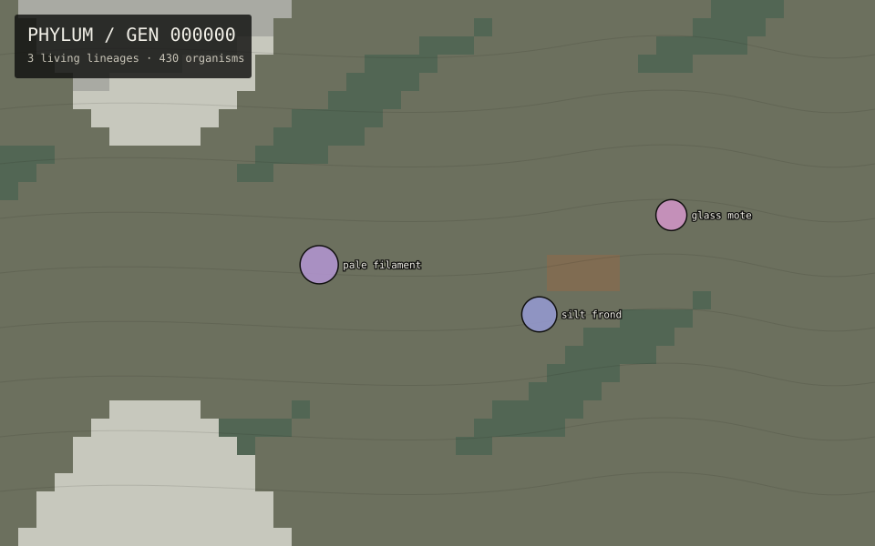

# PHYLUM

**An evolutionary simulation written into Git history.**

PHYLUM is a small artificial biosphere that advances itself inside a Git repository. Every generation mutates the persistent world state, redraws the habitat, records important events, and becomes a commit.

Git is not just where PHYLUM's source code lives. **Git is its fossil record.**



<!-- PHYLUM:STATE:START -->
**Generation:** `0`  
**Living lineages:** `3`  
**Extinct lineages:** `0`  
**Population:** `430`  
**Dominant lineage:** `pale filament`  
**Latest fossil:** Three primitive lineages occupy the first habitat.
<!-- PHYLUM:STATE:END -->

## The idea

A scheduled GitHub Action wakes up every six hours and runs one generation of the simulation. Organisms move toward suitable habitats, populations rise and collapse, the climate drifts, lineages split, and extinction events accumulate.

Each run changes files such as:

```text
world/current.json
world/species.json
world/environment.json
renders/current.svg
fossils/events.ndjson
```

The Action then commits those changes. A repository's commit history therefore becomes the chronological history of its biosphere.

```text
gen 000041 — pale filament diverges from glass mote
gen 000104 — A prolonged dry phase begins
gen 000139 — rust bell becomes extinct
gen 000207 — silt frond is the most abundant lineage
```

Check out an old commit and you have literally checked out an extinct version of the world.

## Forks are alternate evolutionary timelines

PHYLUM salts its random stream with the GitHub repository identity. When another person forks the project, that fork inherits the same ancestry but begins producing different evolutionary outcomes on its next generation.

Two forks from the same generation can therefore become two different biospheres.

## Run it locally

PHYLUM has no third-party Python dependencies.

```bash
python -m phylum status
python -m phylum evolve
python -m phylum evolve --steps 100 --lineage local/experiment-a
```

Run the tests:

```bash
python -m unittest discover -s tests -v
```

## Turn on autonomous evolution on GitHub

1. Create a new repository and push this project to its default branch.
2. In **Settings → Actions → General → Workflow permissions**, allow GitHub Actions to have read and write permissions if your repository policy does not already allow it.
3. Open the **Actions** tab and enable workflows if GitHub asks you to.
4. Run **Evolve PHYLUM** manually once with `workflow_dispatch` to verify that the bot can create a generation commit.
5. Leave it alone. The included schedule attempts one generation every six hours.

Scheduled Actions are not guaranteed to execute at the exact scheduled minute, so PHYLUM treats a run as a generation rather than using wall-clock time as biological time.

## Anatomy

```text
PHYLUM/
├── .github/workflows/evolve.yml  # autonomous evolution
├── fossils/events.ndjson         # major events, append-only
├── phylum/                       # simulation engine + CLI
├── renders/current.svg           # current visible world
├── tests/                        # invariant tests
└── world/                        # persistent biosphere state
```

## Current model

The first version deliberately keeps the rules understandable:

- procedural geography with local temperature, moisture, and resources
- inherited temperature/moisture preferences
- environmental tolerance
- mobility, fecundity, and body size traits
- population growth constrained by local carrying capacity
- migration toward more suitable nearby habitat
- heritable mutation and speciation
- extinction when a population collapses
- slow climate drift plus uncommon drought, cooling, and resource-bloom events

The simulation is deterministic for a given world seed, generation, and lineage identifier. That makes histories reproducible while allowing Git forks to diverge naturally.

## What comes next

PHYLUM is designed to grow into stranger territory: predator/prey relationships, sexual reproduction, continental drift, diseases, mass extinctions, phylogenetic tree rendering, fossil browsers, branch comparison, and eventually a rule for what happens when two independently evolved Git branches are merged.

## License

MIT.
